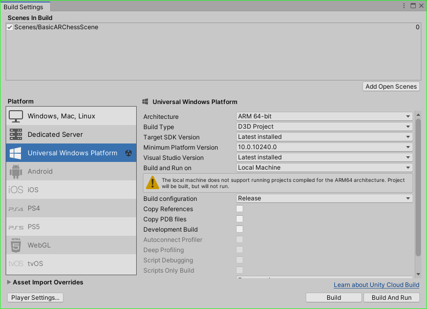
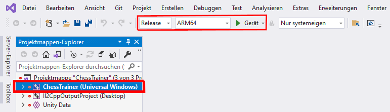

# AR Chess Trainer

## Setup

### Step 1: Install Unity and VisualStudio
To load and create the AR ChessTrainer in Unity, Unity must be installed. Unity can be downloaded from the [official website](https://unity.com/download "Unity website"). It was developed with version 2021.3.1f1, but it can also work with a newer version. In addition, an installation of Visualstudio is required. It was developed with version 2019. See [installation guide](https://docs.microsoft.com/en-us/windows/mixed-reality/develop/install-the-tools?tabs=unity "install the tools") for more information.

### Step 2: Open the project in Unity
Download the repository as a zip or clone it. To open the AR Chess Trainer in Unity, you need to add the downloaded project in Unity Hub and then you can open it. Open the Unity Hub and select `Open`. In the following window, navigate to the project or repository and click `Open`. If a newer version is installed, you can select a locally installed one under the version number. Unity will then adjust the project. However, this can lead to errors. Therefore, the version in step 1 is recommended.

### Step 3: Build the application (Unity)
To build the application, make sure that the scene is also present in the build settings. If not, `Add Open Scenes` can be used to add the scene opened in the editor. Furthermore, it must be ensured that the following settings are applied:
 
If everything has been configured, the application can be built by clicking on "Build".

### Step 4: Pair your HoleLens with your computer
To deploy an application to the Hololens, the Hololens must first be paired with the developer computer. This only needs to be done once. There are several options which can be viewed on the [Using the Windows Device Portal](https://docs.microsoft.com/en-us/windows/mixed-reality/develop/advanced-concepts/using-the-windows-device-portal "Using the Windows Device Portal").

### Step 5: Deploy the application
In the directory where the application was built in step 3 is a `ChessTrainer.sln` solution. Open the solution with a double click in Visual Studio. Check that the following settings are set:
 
`ChessTrainer (Universal Windows)` must be set as a startup project with a right click and `Set as startup project`. Once the Hololens is paired and connected to the PC, the application be deployed by clicking on the green arrow.